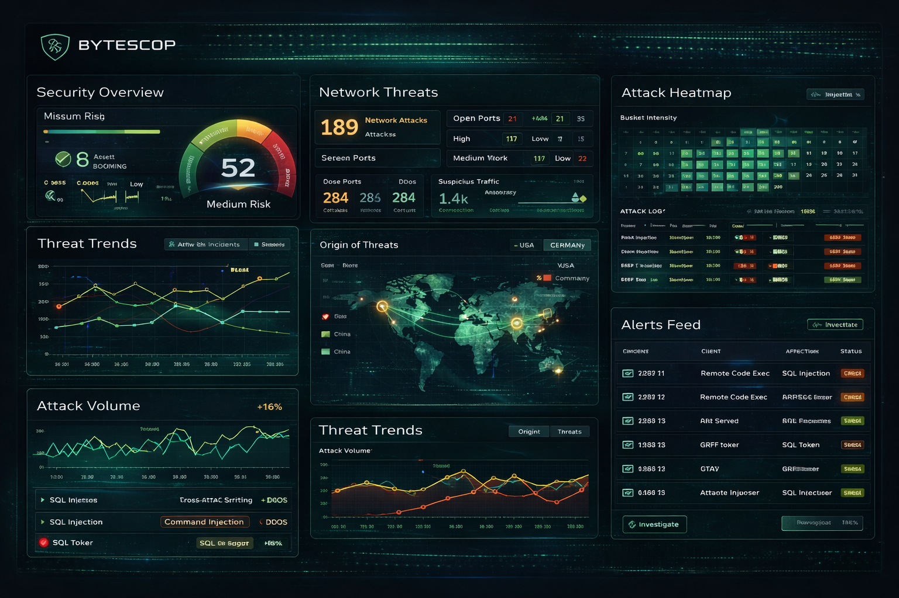

# BytesCop



**Security findings management platform** — consolidate pen tests, vulnerability scans, and manual assessments into a single source of truth.

BytesCop is source-available. Full source code is publicly accessible for review, audit, and development. Self-host for free (Community Edition) or purchase an Enterprise license for advanced features.

## Table of Contents

- [Quick Start](#quick-start)
- [Architecture](#architecture)
- [Configuration](#configuration)
- [Community Edition Limits](#community-edition-limits)
- [Logs](#logs)
- [Data Persistence](#data-persistence)
- [Development](#development)
- [License](#license)
- [Support](#support)

## Quick Start

### Prerequisites

- [Docker](https://docs.docker.com/get-docker/) (20.10+)
- [Docker Compose](https://docs.docker.com/compose/install/) (v2+)

### Install

```bash
git clone https://github.com/palavitech/bytescop.git
cd bytescop
./install.sh
```

This will:
1. Generate a `.env` file with random secrets
2. Build Docker images
3. Start all services (database, API, workers, frontend)
4. Run database migrations

Open **http://localhost** and complete the setup wizard to create your admin account and first workspace.

### Update

```bash
./update.sh
```

Pulls the latest code, rebuilds images, runs migrations, and restarts services. A backup is created automatically before updating.

### Backup

```bash
./backup.sh
```

Creates a timestamped backup of the database and media files in `./backups/`.

## Architecture

BytesCop runs as 7 Docker containers:

| Service | Purpose |
|---------|---------|
| **db** | PostgreSQL 16 database |
| **redis** | Message broker for async tasks |
| **api** | Django REST API (gunicorn) |
| **worker-notify** | Celery worker for email notifications |
| **worker-jobs** | Celery worker for heavy tasks (exports, purges) |
| **beat** | Celery Beat scheduler (periodic cleanup) |
| **nginx** | Reverse proxy + serves Angular frontend |

All application containers use the same Docker image with different entrypoint commands. Total memory footprint is ~900MB.

## Configuration

Edit `.env` to configure:

| Variable | Default | Description |
|----------|---------|-------------|
| `POSTGRES_PASSWORD` | (generated) | Database password |
| `DJANGO_SECRET_KEY` | (generated) | Django secret key |
| `DJANGO_ALLOWED_HOSTS` | `localhost,127.0.0.1` | Comma-separated allowed hostnames |
| `BC_PORT` | `80` | Port to expose the application |
| `EMAIL_HOST` | _(optional)_ | SMTP server for email notifications |
| `EMAIL_PORT` | `587` | SMTP port |
| `EMAIL_HOST_USER` | _(optional)_ | SMTP username |
| `EMAIL_HOST_PASSWORD` | _(optional)_ | SMTP password |
| `DEFAULT_FROM_EMAIL` | _(optional)_ | Sender address for emails |
| `BC_LICENSE_KEY` | _(optional)_ | Enterprise license key |

### Email (Optional)

BytesCop works fully without email configured. When SMTP is set up, you get:
- Password reset emails
- User invitation emails
- Export completion notifications
- MFA enrollment notifications

### Account Recovery

If you forget your admin password or lose your MFA device, you can recover access from the server:

```bash
./reset-password.sh your@email.com    # Reset your password
./reset-mfa.sh your@email.com         # Disable MFA so you can re-enroll on next login
```

These require SSH access to the server. Use `--help` on any script for full usage.

### HTTPS

BytesCop ships with HTTPS enabled using a self-signed certificate (generated automatically during install). Your browser will show a certificate warning on first visit — this is expected.

To use your own certificate (Let's Encrypt, corporate CA, etc.), replace the files in `ssl/` and restart nginx:

```bash
cp /path/to/your/cert.crt ssl/bytescop.crt
cp /path/to/your/cert.key ssl/bytescop.key
docker compose restart nginx
```

HTTP (port 80) automatically redirects to HTTPS (port 443).

## Community Edition Limits

| Resource | Limit |
|----------|-------|
| Workspaces | 1 |
| Users per workspace | 3 |
| Clients | 5 |
| Assets | 10 |
| Engagements | 5 |
| Findings per engagement | 20 |
| Images per finding | 5 |

Enterprise licenses remove all limits and unlock additional features (RBAC, audit trail, data export, custom branding).

## Logs

All logs are written to the `./logs/` directory on the host machine:

| File | Service |
|------|---------|
| `logs/bytescop.log` | API (Django/gunicorn) |
| `logs/worker-notify.log` | Email notification worker |
| `logs/worker-jobs.log` | Background job worker (exports, purges) |
| `logs/beat.log` | Celery Beat scheduler |
| `logs/nginx/access.log` | Nginx access log |
| `logs/nginx/error.log` | Nginx error log |

View logs in real time:

```bash
docker compose logs -f api           # API stdout
docker compose logs -f worker-jobs   # Job worker stdout
tail -f logs/bytescop.log            # API log file directly
```

Log level can be configured in `.env`:

```bash
BYTESCOP_LOG_LEVEL=DEBUG    # API log level (default: INFO)
DJANGO_LOG_LEVEL=INFO       # Django framework log level (default: WARNING)
```

## Data Persistence

| Directory | Contents |
|-----------|----------|
| `./data/postgres/` | PostgreSQL database files |
| `./logs/` | All service log files |
| `./ssl/` | SSL certificates |

These directories persist across `docker compose down` and `docker compose up`. To fully reset, delete them and run `./install.sh` again.

## Development

### Architecture

Development uses a **hybrid** setup: infrastructure runs in Docker, application code runs locally for instant hot-reload.

| Service | Runs in | Why |
|---------|---------|-----|
| PostgreSQL | Docker | Stateful, rarely changes |
| Redis | Docker | Stateful, rarely changes |
| Celery workers | Docker | Background tasks, rarely need debugging |
| Celery Beat | Docker | Scheduler, rarely changes |
| **API** | **Local (venv)** | Hot-reload on save via `manage.py runserver` |
| **UI** | **Local (ng serve)** | Hot-reload on save via Angular dev server |
| nginx | Not used | Angular proxy handles `/api/` routing |

Production uses the full Docker stack (`docker compose up`) — all 7 containers including API, UI, and nginx. The dev setup only differs in _where_ the code runs, not _what_ runs.

### Prerequisites

- Python 3.13+ with a virtual environment at `api/.venv/`
- Node.js 22+ (via nvm or system install)
- Docker and Docker Compose v2+

### Quick start (recommended)

Two scripts handle the full setup — run each in its own terminal:

```bash
# Terminal 1 — API (starts Docker infra → migrations → Django dev server)
./api-devrun.sh

# Terminal 2 — UI (installs deps if needed → Angular dev server)
./ui-devrun.sh
```

`api-devrun.sh` checks if the Docker dev stack is already running before starting it, so it's safe to re-run.

To stop everything (Docker containers, API, and UI dev servers):

```bash
./stop-devrun.sh
```

### Manual steps (if you prefer)

<details>
<summary>Click to expand manual setup</summary>

#### 1. Start infrastructure

```bash
# From the project root (bytescop/)
docker compose -f docker-compose.yml -f docker-compose.dev.yml up -d
```

This starts PostgreSQL (port 5432), Redis (port 6379), Celery workers, and Beat. The `docker-compose.dev.yml` override exposes database/redis ports to the host and disables the api, ui, and nginx containers.

#### 2. Run database migrations

```bash
cd api
DJANGO_SETTINGS_MODULE=bytescop.settings.dev \
POSTGRES_PASSWORD=<your .env password> \
.venv/bin/python manage.py migrate
```

Also seed permissions and subscription plans:

```bash
.venv/bin/python manage.py ensure_install_state
.venv/bin/python manage.py ensure_subscription_plans
```

#### 3. Start the API

```bash
cd api
DJANGO_SETTINGS_MODULE=bytescop.settings.dev \
POSTGRES_PASSWORD=<your .env password> \
.venv/bin/python manage.py runserver 0.0.0.0:8000
```

The `dev.py` settings module imports from `base.py` and defaults to `localhost` for PostgreSQL and Redis. Only `POSTGRES_PASSWORD` is needed (from your `.env` file).

#### 4. Start the UI

```bash
cd ui
npm install   # first time only
npx ng serve --host 0.0.0.0 -c local
```

The `local` configuration uses a proxy (`src/proxy.conf.json`) that forwards `/api/*` requests to `http://localhost:8000`. Open **http://localhost:4200** in your browser.

</details>

### Why not full Docker for development?

Rebuilding the UI Docker image takes 3+ minutes (npm install, ng build, copy to volume). With `ng serve`, file changes appear in the browser instantly. Same for the API — Django's dev server auto-reloads on save, while the Docker API requires an image rebuild.

### Settings modules (`api/bytescop/settings/`)

All settings inherit from `base.py`. Dev and production are **independent** — dev does not import from production.

| File | DB | Celery | Use case |
|------|----|----|----------|
| `base.py` | _(none)_ | — | Shared config (all environments) |
| `dev.py` | PostgreSQL (localhost) | Docker workers | Local development (`manage.py runserver`) |
| `test.py` | SQLite in-memory | Fake (no Redis) | Unit tests — no Docker needed |
| `e2e.py` | PostgreSQL (localhost) | Docker workers | End-to-end tests — full stack |
| `production.py` | PostgreSQL (Docker) | Docker workers | On-prem deployment |

**`dev.py`** relaxes HTTPS cookie requirements (`Secure=False`, `SameSite=Lax`) and adds CORS origins for the Angular dev server. It does **not** change middleware, auth flow, or any business logic.

**`test.py`** uses SQLite in-memory and a fake event publisher — no external services needed. Tests run instantly with zero infrastructure.

**`e2e.py`** inherits from `dev.py` and adds test speed optimisations (fast password hasher, quieter logging). Requires Docker infra running.

### Viewing logs

**Docker services** (infrastructure):

```bash
# All Docker containers
docker compose -f docker-compose.yml -f docker-compose.dev.yml logs -f

# Specific service
docker compose -f docker-compose.yml -f docker-compose.dev.yml logs -f worker-notify
```

**API** (local): logs print directly to your terminal. Set `BYTESCOP_LOG_LEVEL=DEBUG` for verbose output. Set `BYTESCOP_SQL_LOG=1` to see raw SQL queries.

**UI** (local): Angular dev server output prints to your terminal. Browser console shows frontend errors.

### Reset dev database

Flush all data (database, Redis, media files) and start fresh:

```bash
./flush_dev.sh
```

This drops and recreates the database schema, flushes Redis, clears local media files, re-runs all migrations, and seeds required data. You'll be prompted to type `FLUSH` to confirm. The app returns to the setup wizard state after flushing.

Requires the Docker dev stack to be running (PostgreSQL and Redis).

### Running tests

**API unit tests** (no Docker needed):

```bash
cd api
.venv/bin/python manage.py test engagements accounts -v 2 --settings=bytescop.settings.test
```

Uses SQLite in-memory — no `.env`, no Docker, no PostgreSQL required.

**API end-to-end tests** (requires Docker infra):

```bash
cd api
.venv/bin/python manage.py test -v 2 --settings=bytescop.settings.e2e
```

Requires Docker dev stack running (PostgreSQL + Redis + Celery workers).

**API tests with coverage:**

```bash
cd api
.venv/bin/coverage run --source='.' manage.py test --settings=bytescop.settings.test
.venv/bin/coverage report --skip-empty     # terminal summary
.venv/bin/coverage html -d htmlcov         # HTML report → api/htmlcov/index.html
```

**UI tests:**

```bash
cd ui
npx ng test --watch=false --code-coverage
```

### Stopping everything

```bash
# One command — stops Docker, API, and UI dev servers
./stop-devrun.sh

# Or manually:
docker compose -f docker-compose.yml -f docker-compose.dev.yml down
# API and UI: Ctrl+C in their respective terminals
```

### Testing with the full production stack

To validate changes as they'll run in production (Docker, gunicorn, nginx, HTTPS):

```bash
docker compose up --build -d
docker compose exec api python manage.py migrate
docker compose exec api python manage.py ensure_install_state
docker compose exec api python manage.py ensure_subscription_plans
```

Open **https://localhost** (self-signed cert warning is expected). This is the same stack customers run.

## License

BytesCop is licensed under the [Elastic License 2.0](LICENSE.md). See the LICENSE file for details.

- **Free**: Use, copy, distribute, and modify for any purpose
- **Two restrictions**: (1) You may not offer BytesCop as a hosted/managed service, (2) You may not circumvent or remove license key functionality

## Support

- **Bug reports**: [GitHub Issues](https://github.com/palavitech/bytescop/issues)
- **Feature requests**: [GitHub Discussions](https://github.com/palavitech/bytescop/discussions)
- **Documentation**: [GitHub Wiki](https://github.com/palavitech/bytescop/wiki)
